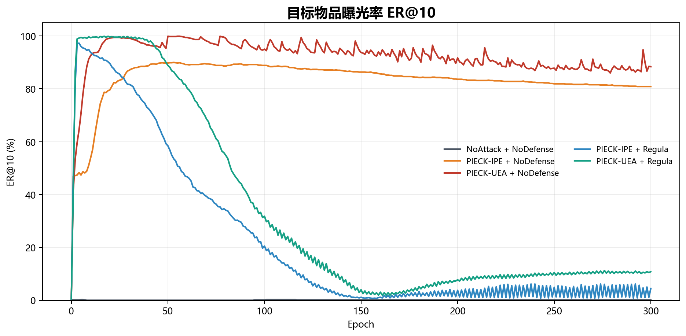
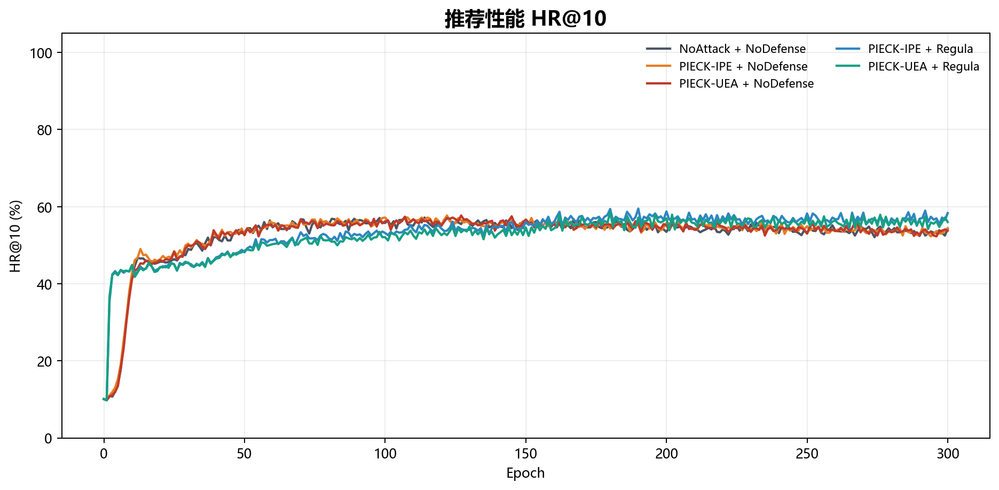
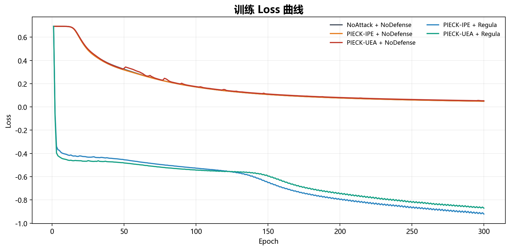

# PIECK 复现实验仓库（MF-FRS / ML-100K）

本仓库整理了《机器学习与安全》课程大作业中 PIECK 论文的代码复现部分。

复现论文为：

> Jun Zhang, Huan Li, Dazhong Rong, Yan Zhao, Ke Chen, and Lidan Shou.
> Preventing the Popular Item Embedding Based Attack in Federated Recommendations.
> IEEE ICDE 2024.

本仓库聚焦论文中的 MF-FRS 场景，并使用预处理后的 ML-100K 数据集。仓库保留原始复现代码结构，
新增 Python 批量运行入口、结果解析脚本、环境依赖文件和中文说明文档，便于教师核验和他人复现。

## 仓库结构

```text
.
|-- MF-FRS/                  # 矩阵分解联邦推荐复现代码
|   |-- main.py              # 单组实验训练入口
|   |-- attack.py            # PIECK-IPE 与 PIECK-UEA 攻击逻辑
|   |-- client.py            # 正常客户端与 Regula 防御客户端
|   |-- server.py            # 服务端物品嵌入聚合逻辑
|   `-- Data/ML-100K/        # 本次复现使用的预处理 ML-100K 数据
|-- run_experiments.py       # 五组实验的 Python 批量运行入口
|-- parse_results.py         # 日志解析、CSV 汇总和曲线图生成脚本
|-- requirements.txt         # 已验证的 Python 依赖版本
`-- results/
    |-- logs/                # 五组 300 epoch 实验完整日志
    |-- data/                # 解析后的指标 CSV 与论文对照表
    |-- figures/             # ER@10、HR@10、Loss 曲线
    |-- environment.txt      # 复现实验环境记录
    `-- run_status.csv       # 五组实验完成状态
```

## 环境配置

本次提交结果使用如下环境完成：

| 项目 | 配置 |
| --- | --- |
| 操作系统 | Windows 11 64-bit |
| Python | 3.12.11，Anaconda Torch2 环境 |
| PyTorch | 2.8.0+cu126 |
| NumPy | 2.1.2 |
| Matplotlib | 3.10.7 |
| CUDA | PyTorch CUDA 12.6 |
| GPU | NVIDIA GeForce RTX 4060 Laptop GPU，8188 MiB |

安装已验证的 CUDA 版本依赖：

```bash
python -m pip install -r requirements.txt
```

如果只使用 CPU 环境，可以改装 CPU 版本 PyTorch，再安装其余依赖：

```bash
python -m pip install torch==2.8.0 --index-url https://download.pytorch.org/whl/cpu
python -m pip install numpy==2.1.2 matplotlib==3.10.7
```

脚本支持 CPU 运行，但完整五组 300 epoch 实验会明显慢于 GPU。

## 复现命令

运行报告中的五组 300 epoch 实验：

```bash
python run_experiments.py --epochs 300 --device cuda:0
```

如果对应日志已经到达目标 epoch，脚本会自动跳过该组实验。需要强制重新运行时使用：

```bash
python run_experiments.py --epochs 300 --device cuda:0 --force
```

只运行部分实验：

```bash
python run_experiments.py --cases 02_pieckipe_nodefense 03_pieckuea_nodefense --epochs 300 --device cuda:0
```

只查看将要执行的命令，不启动训练：

```bash
python run_experiments.py --dry-run
```

基于已有日志重新生成 CSV 汇总和曲线图：

```bash
python parse_results.py --expected-epochs 300
```

本仓库固定整理的五组实验如下：

| 实验编号 | 攻击方法 | 防御方法 | 热门物品数量 |
| --- | --- | --- | --- |
| `01_noattack_nodefense` | NoAttack | NoDefense | 150 |
| `02_pieckipe_nodefense` | PIECK-IPE | NoDefense | 10 |
| `03_pieckuea_nodefense` | PIECK-UEA | NoDefense | 150 |
| `04_pieckipe_regula` | PIECK-IPE | Regula | 10 |
| `05_pieckuea_regula` | PIECK-UEA | Regula | 150 |

## 报告使用的复现结果

仓库中已保留五组完整训练日志，均到达第 300 epoch。由
`results/data/final_metrics.csv` 解析得到的最终指标如下：

| 攻击 | 防御 | Loss | HR@5 | HR@10 | HR@20 | ER@5 | ER@10 | ER@20 |
| --- | --- | ---: | ---: | ---: | ---: | ---: | ---: | ---: |
| NoAttack | NoDefense | 0.0488 | 35.52 | 54.29 | 71.58 | 0.00 | 0.11 | 0.23 |
| PIECK-IPE | NoDefense | 0.0488 | 37.22 | 54.40 | 73.91 | 79.16 | 80.87 | 82.80 |
| PIECK-UEA | NoDefense | 0.0529 | 36.80 | 53.76 | 72.43 | 87.13 | 88.38 | 88.95 |
| PIECK-IPE | Regula | -0.9209 | 38.07 | 58.32 | 75.93 | 2.62 | 4.44 | 7.29 |
| PIECK-UEA | Regula | -0.8704 | 38.49 | 55.99 | 75.29 | 10.02 | 10.82 | 12.76 |

与论文 Table III / Table IV 中记录数值的对比如下：

| 实验 | 复现 ER@10 | 论文 ER@10 | ER@10 差值 | 复现 HR@10 | 论文 HR@10 | HR@10 差值 |
| --- | ---: | ---: | ---: | ---: | ---: | ---: |
| NoAttack + NoDefense | 0.11 | 0.23 | -0.12 | 54.29 | 57.16 | -2.87 |
| PIECK-IPE + NoDefense | 80.87 | 87.47 | -6.60 | 54.40 | 57.69 | -3.29 |
| PIECK-UEA + NoDefense | 88.38 | 93.39 | -5.01 | 53.76 | 57.69 | -3.93 |
| PIECK-IPE + Regula | 4.44 | 1.25 | +3.19 | 58.32 | 56.31 | +2.01 |
| PIECK-UEA + Regula | 10.82 | 0.00 | +10.82 | 55.99 | 55.89 | +0.10 |

复现实验没有完全达到论文中的全部数值，但核心趋势一致：无防御条件下，PIECK-IPE 与 PIECK-UEA
显著提升目标物品曝光率；加入 Regula 后，目标曝光率明显下降，同时 HR@10 没有出现明显崩溃。

## 曲线图

目标物品曝光率 ER@10：



推荐性能 HR@10：



训练 Loss：



## 核验材料说明

教师或复现者可通过以下文件核验实验过程与结果：

| 文件 | 用途 |
| --- | --- |
| `results/logs/01-05_*.log` | 五组 300 epoch 实验完整终端输出 |
| `results/run_status.csv` | 每组实验是否完成以及对应日志路径 |
| `results/environment.txt` | Python、PyTorch、CUDA、GPU、OS、CPU 等环境信息 |
| `results/data/metrics_by_epoch.csv` | 五组实验逐 epoch 指标 |
| `results/data/final_metrics.csv` | 第 300 epoch 最终指标 |
| `results/data/paper_comparison.csv` | 复现结果与论文 Table III / IV 的对照 |
| `results/data/summary.json` | 机器可读的复现实验摘要 |
| `results/figures/*.png` | 报告中使用的三张曲线图 |

推荐使用以下命令进行本地检查：

```bash
python -m compileall MF-FRS parse_results.py run_experiments.py
python parse_results.py --expected-epochs 300
python run_experiments.py --dry-run
```

## 参考文献

[1] Jun Zhang, Huan Li, Dazhong Rong, Yan Zhao, Ke Chen, and Lidan Shou.
Preventing the Popular Item Embedding Based Attack in Federated Recommendations.
IEEE ICDE 2024.

[2] Xiangnan He, Lizi Liao, Hanwang Zhang, Liqiang Nie, Xia Hu, and Tat-Seng
Chua. Neural Collaborative Filtering. WWW 2017.

[3] H. Brendan McMahan, Eider Moore, Daniel Ramage, Seth Hampson, and Blaise
Agüera y Arcas. Communication-Efficient Learning of Deep Networks from
Decentralized Data. AISTATS 2017.

[4] Eugene Bagdasaryan, Andreas Veit, Yiqing Hua, Deborah Estrin, and Vitaly
Shmatikov. How to Backdoor Federated Learning. AISTATS 2020.

[5] Minghong Fang, Xiaoyu Cao, Jinyuan Jia, and Neil Zhenqiang Gong. Local Model
Poisoning Attacks to Byzantine-Robust Federated Learning. USENIX Security 2020.
